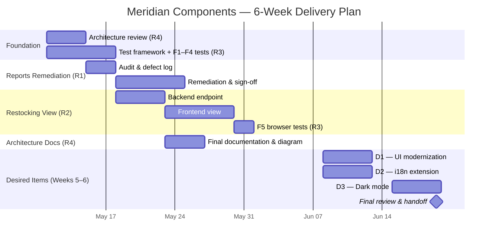

# Timeline

**RFP #:** MC-2026-0417
**Section:** §4.4

---

We are proposing a six-week engagement beginning the week of May 11, 2026 (assuming vendor selection by May 9). The required items (R1–R4) are delivered by end of week four. Weeks five and six are reserved for desired items (D1–D3), contingent on required scope being accepted and stable.

The engagement opens with two parallel tracks: architecture review (R4) to orient the team, and test framework setup (R3) to establish a baseline before any changes are made. Reports remediation (R1) follows immediately, with the Restocking view (R2) beginning once R1 is stable.

---

## Milestones

| Milestone | Target date |
|---|---|
| Test baseline established (F1–F4) | May 22, 2026 |
| Reports module remediated (R1) | May 29, 2026 |
| Restocking view live (R2) | June 5, 2026 |
| Full browser test suite complete (R3 + F5) | June 9, 2026 |
| Architecture documentation delivered (R4) | June 9, 2026 |
| Required scope complete — IT sign-off checkpoint | June 9, 2026 |
| Desired items delivered (D1–D3) | June 19, 2026 |
| Engagement close & handoff | June 19, 2026 |

---

## Assumptions

- Engagement start date of May 11, 2026 assumes vendor selection no later than May 9.
- Meridian IT is available for a one-hour sign-off review at end of week four (June 5).
- Desired items scope (D1–D3) is confirmed at kickoff; material changes after week four may affect delivery.
- No dependency on Meridian systems beyond read access to the existing codebase and the ability to run the application locally.
